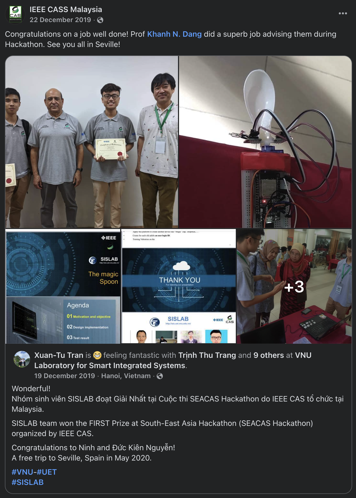

## Vibration-Compensated Spoon (SEACAS 2019 Hackathon, ISCAS 2020 Student Design Contest)

<iframe src="https://www.facebook.com/plugins/post.php?href=https%3A%2F%2Fwww.facebook.com%2Fieee.cass.my%2Fposts%2Fpfbid0gWhx6YnBWgTmV3N5qk6dQjvaPVzKeybkULrfPnHYMum2YEJZngA6xKmVzT8hYGWJl&show_text=true&width=500" width="100%" height="786" style="border:none;overflow:hidden" scrolling="no" frameborder="0" allowfullscreen="true" allow="autoplay; clipboard-write; encrypted-media; picture-in-picture; web-share"></iframe>
Our students won the 1st prize at the SEACAS 2019 Hackathon with the "Magic Spoon" project, a prototype designed to stabilize hand tremors commonly experienced by Parkinson's patients. Unlike conventional PID control, this project utilized a single-layer perceptron to control a servo motor, and included a database and Android application for diagnosis and treatment suggestions.

Our team also participated in the IEEE CASS Student Design Competition, held as part of [ISCAS 2020](https://ieee-cas.org/event/cass-student-design-competition-2020-covid-19-special) in Seville, Spain, with both in-person and online attendance due to the Covid-19 pandemic.
